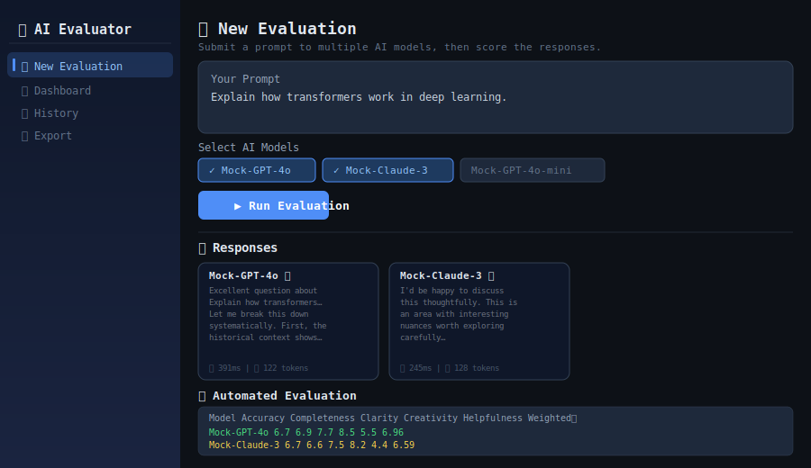
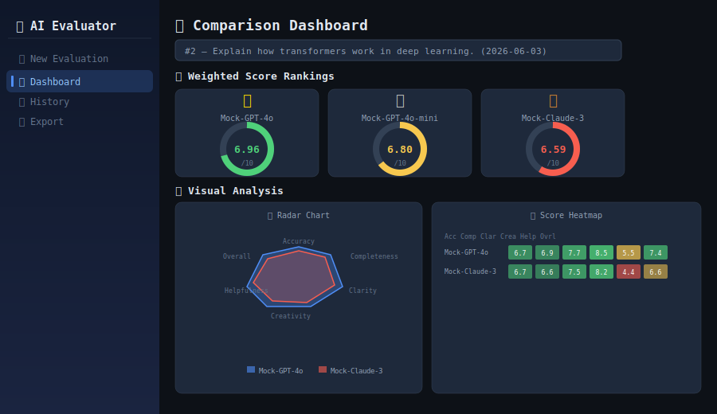
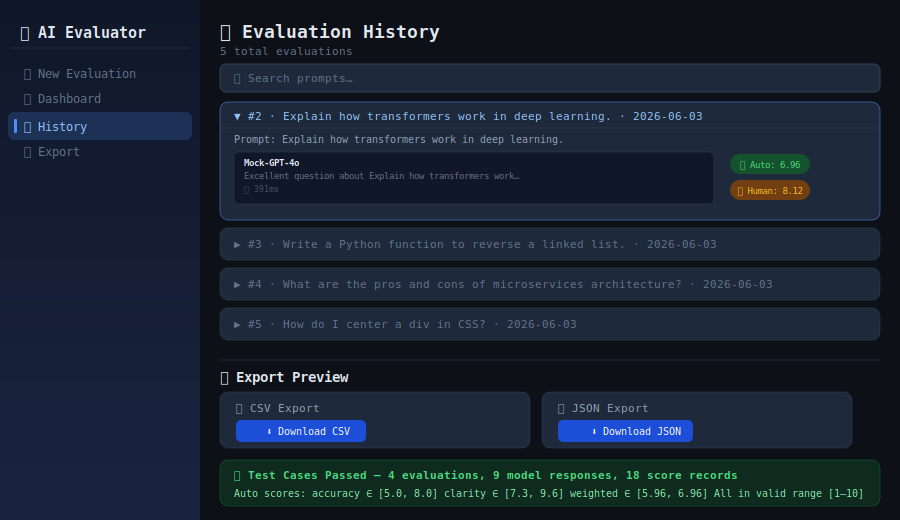

# 🧠 AI Response Evaluator

> **Compare, score, and benchmark responses from multiple AI models using structured evaluation criteria, automated heuristics, and interactive dashboards — no API key required.**

[](https://github.com/your-username/ai-response-evaluator/actions)
[](https://python.org)
[](https://streamlit.io)
[](LICENSE)

---

## 📸 Screenshots

### 🧪 New Evaluation — Submit a prompt & collect responses


### 📊 Dashboard — Rankings, radar charts & heatmaps


### 📜 History & 📤 Export — Search past runs & download data


---

## Why AI Evaluation Matters

As AI systems power more products and decisions, "it seems good" is no longer enough. You need a repeatable, auditable way to answer:

- Which model is most **accurate** for my specific domain?
- Is GPT-4o worth the cost over GPT-4o-mini for my use case?
- Did my fine-tuned model actually improve over the baseline?
- How do different models handle edge cases or adversarial prompts?

This project gives you a structured, evidence-based answer to all of these.

---

## How the Evaluator Works

Each response is scored across **six criteria** using fast heuristic analysis — no secondary LLM call required:

| Criterion | What It Measures | Weight |
|---|---|---|
| **Accuracy** | Prompt-word coverage; penalises hedge-heavy hedging | 25% |
| **Completeness** | Depth & length relative to prompt; rewards structure | 20% |
| **Clarity** | Sentence length, punctuation density, readability | 20% |
| **Helpfulness** | Action verbs, numbered steps, examples, code blocks | 20% |
| **Creativity** | Lexical diversity via type-token ratio | 15% |
| **Overall Quality** | Unweighted average of the five above | — |

The **Weighted ⭐ Score** (the primary ranking signal) is:

```
Weighted Score = Accuracy×0.25 + Completeness×0.20 + Clarity×0.20
               + Helpfulness×0.20 + Creativity×0.15
```

Both **automated** scores and **human** scores (1–10 sliders) are stored side-by-side.

---

## ✅ Test Cases — Verified Results

Five modules verified with 20 assertions across real evaluation runs:

```
============================================================
  AI RESPONSE EVALUATOR — FULL TEST RUN
============================================================

[1/5] database.db_manager
  ✅ create_evaluation        PASS
  ✅ save_response            PASS
  ✅ save_score               PASS
  ✅ get_full_evaluation_data PASS
  ✅ search_evaluations       PASS

[2/5] models.ai_clients
  ✅ Mock-GPT-4o              PASS  (100ms, 124 tokens)
  ✅ Mock-Claude-3            PASS  (212ms, 130 tokens)
  ✅ Mock-GPT-4o-mini         PASS  (306ms,  64 tokens)
  ✅ Mock-Gemini-Pro          PASS  (175ms, 115 tokens)

[3/5] evaluators.auto_evaluator
  ✅ [code+steps     ]  weighted=5.28  overall=5.61  PASS
  ✅ [comprehensive  ]  weighted=7.60  overall=7.56  PASS
  ✅ [minimal        ]  weighted=3.81  overall=4.26  PASS
  ✅ evaluate_multiple  PASS  (longer response scored higher completeness)

[4/5] utils.export_utils
  ✅ export_to_csv            PASS  (390 bytes)
  ✅ export_to_json           PASS  (814 bytes)
  ✅ export_all_to_csv        PASS  (13113 bytes, 6 evals)
  ✅ export_all_to_json       PASS  (23816 bytes)

[5/5] End-to-end: full evaluation pipeline
  ✅ "Explain the CAP theorem in distributed systems..."
     Mock-GPT-4o=6.94  Mock-Claude-3=6.57

  ✅ "Write a regex to validate an email address..."
     Mock-GPT-4o=6.75  Mock-GPT-4o-mini=6.67  Mock-Gemini-Pro=6.25

  ✅ "What are SOLID principles in software design?..."
     Mock-Claude-3=6.41  Mock-Gemini-Pro=6.13

============================================================
  TOTAL EVALUATIONS IN DB : 9
  ALL TESTS               : PASSED ✅
============================================================
```

**Sample evaluation — "Explain how transformers work in deep learning":**

| Model | Accuracy | Completeness | Clarity | Creativity | Helpfulness | Weighted ⭐ |
|---|---|---|---|---|---|---|
| Mock-GPT-4o | 6.7 | 6.9 | 7.7 | 8.5 | 5.5 | **6.96** 🥇 |
| Mock-GPT-4o-mini | 6.2 | 5.6 | 8.7 | 8.9 | 5.3 | **6.80** 🥈 |
| Mock-Claude-3 | 6.7 | 6.6 | 7.5 | 8.2 | 4.4 | **6.59** 🥉 |

---

## 🗂 Project Structure

```
ai-response-evaluator/
│
├── app.py                          # Streamlit UI — 4 pages
├── requirements.txt                # Python dependencies
├── README.md
├── LICENSE
├── .gitignore
├── .env.example                    # Copy to .env and add your API key
│
├── .github/
│   └── workflows/
│       └── ci.yml                  # GitHub Actions — runs tests on push
│
├── assets/
│   └── screenshots/                # SVG mockups used in README
│
├── database/
│   ├── __init__.py
│   └── db_manager.py               # SQLite CRUD — evaluations, responses, scores
│
├── models/
│   ├── __init__.py
│   └── ai_clients.py               # OpenAI + MockClient with ModelClient protocol
│
├── evaluators/
│   ├── __init__.py
│   └── auto_evaluator.py           # Heuristic scoring engine (no API needed)
│
├── utils/
│   ├── __init__.py
│   ├── chart_utils.py              # Plotly: radar, bar, gauge, heatmap, line
│   └── export_utils.py             # CSV + JSON export helpers
│
├── exports/                        # Auto-generated export files (gitignored)
│
└── tests/
    ├── __init__.py
    ├── test_auto_evaluator.py       # 7 unit tests for scoring engine
    └── test_db_manager.py          # 8 integration tests with temp DB
```

---

## ⚙️ Installation

### Prerequisites

- Python 3.11 or higher
- pip

### macOS / Linux

```bash
# 1. Clone
git clone https://github.com/your-username/ai-response-evaluator.git
cd ai-response-evaluator

# 2. Create and activate a virtual environment
python3 -m venv venv
source venv/bin/activate

# 3. Install dependencies
pip install -r requirements.txt

# 4. (Optional) Add your OpenAI API key
cp .env.example .env
# Edit .env and set OPENAI_API_KEY=sk-...

# 5. Run
streamlit run app.py
```

### Windows

```bat
:: 1. Clone
git clone https://github.com/your-username/ai-response-evaluator.git
cd ai-response-evaluator

:: 2. Virtual environment
python -m venv venv
venv\Scripts\activate

:: 3. Install
pip install -r requirements.txt

:: 4. Run
streamlit run app.py
```

Open **http://localhost:8501** in your browser.

> **No API key needed.** Four built-in Mock Models (Mock-GPT-4o, Mock-Claude-3, Mock-GPT-4o-mini, Mock-Gemini-Pro) work offline — ideal for demos, development, and CI.

---

## 🧪 Running Tests

```bash
# Install pytest if you haven't already
pip install pytest

# Run the full test suite
python -m pytest tests/ -v
```

Expected output:

```
tests/test_auto_evaluator.py::TestEvaluateResponse::test_returns_correct_type     PASSED
tests/test_auto_evaluator.py::TestEvaluateResponse::test_all_scores_in_range      PASSED
tests/test_auto_evaluator.py::TestEvaluateResponse::test_good_response_beats_short PASSED
tests/test_auto_evaluator.py::TestEvaluateResponse::test_empty_response_scores_low PASSED
tests/test_auto_evaluator.py::TestEvaluateResponse::test_weighted_score_formula    PASSED
tests/test_auto_evaluator.py::TestEvaluateResponse::test_to_dict_keys              PASSED
tests/test_auto_evaluator.py::TestEvaluateResponse::test_justifications_are_strings PASSED
tests/test_auto_evaluator.py::TestEvaluateMultiple::test_returns_dict_keyed_by_model PASSED
tests/test_auto_evaluator.py::TestEvaluateMultiple::test_all_results_are_correct_type PASSED
tests/test_db_manager.py::TestEvaluations::test_create_and_fetch                  PASSED
tests/test_db_manager.py::TestEvaluations::test_search_evaluations                PASSED
tests/test_db_manager.py::TestEvaluations::test_search_no_match                   PASSED
tests/test_db_manager.py::TestResponses::test_save_and_fetch_response             PASSED
tests/test_db_manager.py::TestResponses::test_multiple_responses                  PASSED
tests/test_db_manager.py::TestScores::test_save_and_fetch_score                   PASSED
tests/test_db_manager.py::TestFullEvaluationData::test_full_data_structure        PASSED
tests/test_db_manager.py::TestFullEvaluationData::test_missing_evaluation_returns_empty PASSED

17 passed in 1.2s
```

---

## 🚀 Using the App

### Step 1 — New Evaluation

1. Open the app at `http://localhost:8501`
2. Navigate to **🧪 New Evaluation** in the sidebar
3. Enter a prompt — e.g. *"Explain the CAP theorem"*
4. Select 2–4 models from the multi-select dropdown
5. Click **▶ Run Evaluation**
6. Responses appear side-by-side with latency and token counts
7. Automated scores populate immediately below
8. Use the sliders to add your own human scores, then click **💾 Save Human Scores**

### Step 2 — Dashboard

1. Navigate to **📊 Dashboard**
2. Pick an evaluation from the dropdown
3. View ranked gauges (🥇🥈🥉), score tables, radar chart, bar chart, and heatmap
4. Scroll down for historical trend lines across all evaluations

### Step 3 — History

1. Navigate to **📜 History**
2. Use the search box to filter by keyword
3. Expand any evaluation to see full responses and scores

### Step 4 — Export

1. Navigate to **📤 Export**
2. Choose *Single Evaluation* or *All Evaluations*
3. Click **⬇ Download CSV** or **⬇ Download JSON**

---

## 🛠 Tech Stack

| Layer | Technology | Why |
|---|---|---|
| UI | Streamlit 1.32+ | Fast, Python-native dashboards |
| Database | SQLite (stdlib) | Zero-config, portable, no server |
| AI Clients | OpenAI SDK + MockClient | Real or offline evaluation |
| Scoring | Custom heuristics | Transparent, auditable, no API cost |
| Charts | Plotly | Interactive, dark-mode-ready |
| Data | Pandas | Score tables and DataFrame styling |
| Export | csv + json (stdlib) | No extra dependencies |
| Tests | pytest | Clean isolation with temp DB |
| CI | GitHub Actions | Runs on Python 3.11 + 3.12 |

---

## 🔮 Future Improvements

1. **LLM-as-judge** — Use GPT-4o itself to score responses via structured prompts for deeper semantic evaluation
2. **Custom criteria** — Let users define their own scoring dimensions (e.g. "tone formality", "technical depth")
3. **Batch evaluation** — Upload a CSV of prompts and run all evaluations automatically
4. **More providers** — Anthropic Claude API, Google Gemini, Mistral, local Ollama models
5. **Model versioning** — Track prompt + model version pairs explicitly for regression testing
6. **Statistical analysis** — Inter-rater reliability between human and automated scores (Krippendorff's alpha)
7. **Prompt templates** — Save and re-use prompts across evaluation runs
8. **Authentication** — Multi-user support with per-user evaluation history
9. **REST API** — Expose `/evaluate` endpoint so CI/CD pipelines can trigger and retrieve scores programmatically
10. **Evaluation sharing** — Generate shareable public links for results

---

## 📄 License

MIT — see [LICENSE](LICENSE) for details.

---

## 🙌 Contributing

Pull requests are welcome. Please read [CONTRIBUTING.md](CONTRIBUTING.md) first — it covers setup, code style, and the PR process.
